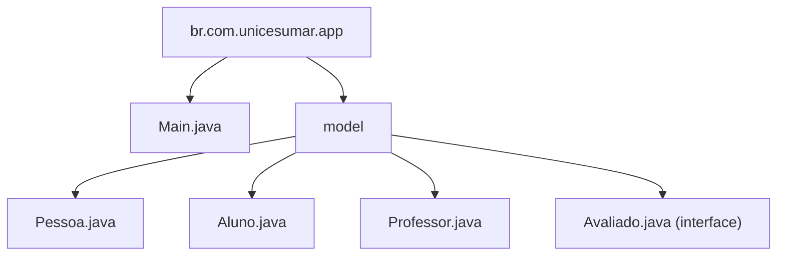

# 💻 Atividade MAPA de Programação Orientada a Objetos – Java

Este projeto foi desenvolvido como parte da disciplina de **Programação Orientada a Objetos** da faculdade **Unicesumar
**. O objetivo é aplicar os principais conceitos da POO em Java, como **classe**, **objeto**, **encapsulamento**, *
*herança**, **polimorfismo** e **interfaces**.

---

## 📁 Estrutura do Projeto



---

## 🧠 Questões Abordadas

### 1️⃣ Classe e Objeto

Criação da classe `Aluno` com os atributos `nome` e `matrícula`. No método `main`, um objeto `Aluno` é instanciado e
seus dados são exibidos no console.

### 2️⃣ Encapsulamento

Os atributos da classe `Aluno` foram modificados para `private`, e foram criados métodos `get` e `set` para acesso
controlado. O nome do aluno é alterado e exibido novamente.

### 3️⃣ Herança

Criação da classe `Pessoa` com o atributo `nome`. A classe `Aluno` herda de `Pessoa` e adiciona o atributo `curso`. A
classe `Professor` também herda de `Pessoa` e possui o atributo `disciplina`. Objetos de ambas as classes são
instanciados e seus dados são exibidos.

### 4️⃣ Polimorfismo

O método `apresentar()` é definido na classe `Pessoa` e sobrescrito nas classes `Aluno` e `Professor`, exibindo
mensagens personalizadas. O método é chamado no `main` para demonstrar polimorfismo.

### 5️⃣ Interface

Criação da interface `Avaliado` com o método `avaliarDesempenho()`. A classe `Aluno` implementa essa interface e retorna
uma mensagem personalizada. O método é chamado no `main`.

---

## 🧪 Exemplo de Saída no Console

```
Questão 1:

Nome: Leonel de Lima Barbosa
Matrícula: 24059760-5

Questão 2:

Nome alterado: Leonel L. Barbosa

Questão 3:

Dados do Aluno:
Nome: Leonel de Lima Barbosa
Curso: Analise e Desenvolvimento de Sistemas
Matrícula: 24059760-5

Dados do Professor:
Nome: Edmar Senne
Disciplina: Programação Orientada a Objetos

Questão 4:

Olá, meu nome é Leonel de Lima Barbosa e curso Analise e Desenvolvimento de Sistemas.
Olá, meu nome é Edmar Senne e leciono Programação Orientada a Objetos.

Questão 5:

O aluno Leonel de Lima Barbosa obteve um desempenho excelente.
